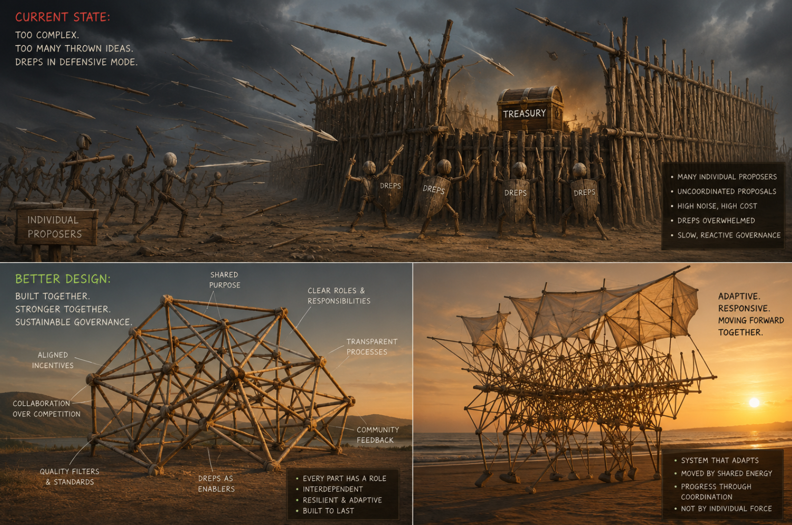

# Cardano를 위한 전략적 예산 거버넌스

## 확장 가능하고 비용 효율적인 트레저리 거버넌스 제안

**언어:** [English](README-short.md) · [Deutsch](README-short.de.md) · [日本語](README-short.ja.md) · **한국어**

> 연결된 상세 문서([README.md](README.md), [docs/](docs/))는 현재 **영어**로 작성되어 있습니다.

**전체 제안:** [README.md](README.md) _(English)_ · **도입 및 파일럿:** [Path Forward](docs/path-forward.md) _(English)_

---

## 문제

Cardano는 트레저리 거버넌스의 탈중앙화에 성공했습니다. DRep, 헌법적 가드레일, 트레저리 인출, 위임 투표가 많은 블록체인 생태계가 아직 달성하지 못한 기반을 마련했습니다.

다음 과제는 정당성이 아니라 **규모와 책임 있는 관리**입니다. 수천 명의 ADA 보유자, 수백 명의 DRep, 관리자, 감사인, 벤더, 미래 참여자가 운영 복잡성에 빠져 있으면서 지속 가능하게 전략적 결정을 내릴 수 없습니다.

본 제안은 동시에 헌법이 **지속적이고 안정화하는 헌법적 요소** — 역할, 권리, 가드레일, 책임 — 에 집중하고, 시장과 상황에 지속적으로 적응해야 하는 집행·운영 규정에서 벗어나도록 합니다. 그러한 운영적 선택은 연간 프레임워크에 속합니다.

오늘날의 제안 중심 모델은 반복적인 마찰을 만듭니다.

* **DRep 과부하** — 유권자에게 전략가, 조달 담당, 감사인, 프로젝트 매니저 역할을 동시에 요구
* **제안 과부하** — 무관한 이니셔티브가 함께 도착해 의미 있는 비교가 불가능
* **약한 비교 가능성** — 유사한 작업이 서로 다른 구조, 조건, 가정으로 제시
* **구조화된 공동 자금 신호 부재** — 거의 모든 요청이 전액 트레저리 자금을 요구하며, 트레저리 비율에 대한 순위 가능 메타데이터 없음
* **모호한 예산 단계** — Net Change Limit 라운드가 고정된 인수인계 없이 서로 대체 가능해, 다분기 계획과 책임이 불명확
* **실행 격차** — 다음 라운드 전 부분 반환 또는 자발적 상환은 납품을 대체해서는 안 됨. 성과는 다음 예산 연도로 이어져야 함
* **NCL 예산 잠금** — 대규모 승인 예산이 미달성해도 NCL 용량을 소비하며 재배정 불가. 미달성 가치가 사이클 후반까지 불명확한 채 다른 제안자가 거부됨

상당한 승인 예산을 받은 제안자는 프로젝트 규모의 상당 부분에 대해 완전히 납품하지 못하거나 마일스톤 승인을 받지 못한 경우가 많음 — 그럼에도 해당 금액은 이미 NCL에서 차감되어 다른 프로젝트에 배정되지 못함. 이는 약속한 산출물 누락일 뿐 아니라 NCL 한도에 들어가지 못한 다른 생태계 참여자에게 경제적 피해를 줌.

대부분의 대규모 조직은 전략 계획, 예산 배분, 조달, 관리, 감사, 실행을 분리합니다. Cardano 거버넌스는 현재 그 부담의 상당 부분을 직접 유권자에게 둡니다. 이는 확장되지 않습니다.

---

## 개념

본 제안은 트레저리 거버넌스를 **제안 중심** 모델에서 **전략적 예산** 모델로 발전시킵니다.

### 프레임워크와 카테고리의 의미

**프레임워크**는 한 예산 연도의 완전한 전략 청사진입니다. 연간 트레저리 규모를 어떻게 나누는지, 어떤 **카테고리**가 존재하는지, 각 레인에 어떤 규칙이 적용되는지를 정의합니다. **카테고리**는 주제별 자금 영역 — 범위, KPI, 부분 예산 비율 — 이며, 개별 프로젝트가 아닙니다. 벤더는 DRep이 프레임워크를 채택한 **후에** 카테고리 **안에서** 프로젝트 슬롯을 경쟁합니다.

설명 예시 — 동일 예산 연도를 위한 두 경쟁 Q4 제안 (가상 수치. 연간 규모 50M ADA 가정):

| 카테고리 | 프레임워크 A — 「Builder-first」 | 프레임워크 B — 「Enterprise & security」 |
| -------- | -------------------------------- | ---------------------------------------- |
| Core infrastructure & reliability | 18M ADA (36%) | 14M ADA (28%) |
| Developer tooling & SDKs | 12M ADA (24%) | — |
| Education & onboarding | 8M ADA (16%) | 4M ADA (8%) |
| Governance tooling & DRep support | 7M ADA (14%) | — |
| Open innovation (넓은 범위) | 5M ADA (10%) | — |
| Enterprise & real-world integrations | — | 15M ADA (30%) |
| Community & events | — | 9M ADA (18%) |
| Security audits & formal methods | — | 8M ADA (16%) |
| **합계** | **50M ADA (100%)** | **50M ADA (100%)** |

DRep은 **프레임워크 전체**에 대한 선호를 순위 매깁니다 — 카테고리를 따로 고르지 않습니다. 승리한 프레임워크가 해당 연도의 카테고리 지도와 부분 예산 비율을 확정합니다. 예: 프레임워크 A에서는 팀이 Q1에 「Developer tooling & SDKs」 안에서 지갑 SDK 프로젝트를 경쟁할 수 있음. 프레임워크 B에서는 그 카테고리가 없지만, 「Security audits & formal methods」가 지갑 라이브러리 감사를 자금 지원할 수 있음.

개요:

1. **연간 프레임워크 우선** — Q4에 경쟁 프레임워크가 카테고리, 예산, KPI, 운영 규칙을 다음 예산 연도용으로 정의. DRep은 무관한 수백 건의 제안이 아닌 선호 투표로 선택.
2. **카테고리 내 분기별 경쟁** — 벤더는 활성 프레임워크가 정한 공유 범위, 레인, KPI 내에서 경쟁. 카테고리별 투표로 DRep은 역량 있는 영역에서 참여하고 영향을 줄 수 있으며, 다른 카테고리의 제안에는 어떤 영향도 없음.
3. **비교 가능한 제출물** — 사람이 읽을 수 있는 서술과 기계 판독 필드를 갖춘 구조화 템플릿.
4. **트레저리 비율과 공동 자금을 사전에** — 모든 인출 신청이 트레저리 대 제안자 기여 비율을 선언.
5. **강력한 공시** — 이해 충돌과 제3자 관계를 투표 전에 공시.
6. **Option 0 항상 투표에** — 트레저리 유보가 모든 자금 결정과 경쟁. 지출은 정당화 필요.
7. **역할 분리** — DRep이 방향과 신뢰 설정. 벤더, 관리자, 감사인은 헌법적 가드레일 하에서 경쟁.

프레임워크는 공공 조달과 기업 예산의 효과적 패턴을 빌리되, **중앙 권한 없는 탈중앙 거버넌스**로 배치합니다. 규칙이 경기장을 정의하고, DRep은 각 단계에서 선택권을 유지. 연간 프레임워크, 카테고리, 조달 구조는 중앙 계획이 아닙니다.

*이는 거버넌스 실험에서 성숙으로 가는 길을 만듭니다.*

---

## 예산 연도 운영 방식

예산 연도는 **달력에 맞춰 고정** — 언제든 대체될 수 있는 NCL 라운드와 대조됩니다.

| 시기 | 내용 | 결정 주체 |
| ---- | ---- | --------- |
| **Q4** | 프레임워크 제안 제출. DRep이 다가올 연간 프레임워크에 순위 투표 | DRep |
| **Q4** | 당해 연도 관찰 가능한 성과 후 관리자 신뢰 재배분 | DRep |
| **매 분기** | 카테고리 내 프로젝트 제출 → 이의 제기 기간 → 정교화 → 확인 투표 | DRep. 확인 시 감사인 |
| **연중** | 마일스톤 납품, 보고, 검증. 평판 이월 | 관리자, 감사인 |

**프레임워크 선정.** Q4에 누구나 완전한 거버넌스 프레임워크 제출 가능. 작성자는 표준 템플릿으로 신원, 이해관계, 이해 충돌 공시. DRep이 순서화된 선호 표명. 가장 강한 집단적 선호가 다음 예산 연도에 활성화. 카테고리는 영구적이지 않음 — 매년 헌법 가드레일 내에서 완전히 새로운 전략 구조 선택 가능.

**카테고리 경쟁.** 프레임워크 승인 후 카테고리는 분기별로 독립 운영. 분기 투표는 우선순위를 정하며 프로젝트 기간(최대 12개월)이 아님. 다년 플래그는 장기 의도를 가시화하나 미래 자금에 대한 **권리는 부여하지 않음** — 각 단계는 고유 사이클에서 재경쟁.

**정교화와 확인.** 첫 투표로 선호 제안 식별. 이후 이의 제기, 명확화, 통합, 정교화. 예산, 공동 자금 조건, 산출물 개선 가능. 두 번째 확인 투표가 담당 감사인 및 최종 자금 조건과 함께 정교화된 제안 비준.

**데이터로서의 거버넌스.** 제안, 프레임워크, 공시, 투표에 구조화 필드 사용. DRep과 도구가 대규모로 필터, 비교, 사전 평가 가능.

*이는 예측 가능성을 만듭니다. 모두가 결정 시점을 압니다.*

선호 투표 방식, 트레저리 비율 필드, 이의 제기 메커니즘, 자금 슬롯, 신규 참여자 레인 상세: [README — Part III](README.md#part-iii---annual-budget-model) _(English)_.

## 설계 원칙

| 원칙 | 의미 | 이것이 만드는 것 |
| ---- | ---- | ---------------- |
| **운영보다 전략** | DRep은 우선순위, 예산, 신뢰, 프로젝트 선정 결정 — 일상적 PM 아님. 실행 규칙은 개별 제안 첨부가 아닌 공유 프레임워크에 속함 | 명확성 — 전략적 결정은 유권자, 실행은 경쟁에 개방 |
| **고정 연간 달력** | 알려진 Q4 프레임워크·신뢰 투표. 분기별 카테고리 경쟁. 명시적 예산 연도 경계 | 예측 가능성 — 계획 및 자금 지원 작업에 대한 책임 |
| **Option 0** | 모든 경쟁에 「미수여／트레저리 유보」를 지출 옵션과 병치 | 트레저리 보호 — 지출 정당화 필요 |
| **공동 자금 메타데이터** | 트레저리 비율은 모든 요청의 구조화·필터 가능 필드. 100% 트레저리 자금도 유효 | 비교 가능성 — 투표 전 제안자 기여 가시화 |
| **제도적 기억** | 납품 이력은 다음 예산 연도로. 부분 반환은 저조한 성과를 지우지 않음 | 책임 — 시간에 따른 성과 가시화 |
| **곳곳의 경쟁** | 프레임워크, 벤더, 관리자, 감사인 모두 경쟁. 대안 없는 역할 없음 | 회복력 — 단일 행위자가 필수 불가결해지지 않음 |

**헌법층 vs 운영층.** 헌법은 역할, 책임, 제약, 일정, 트레저리 가드레일, 책임 메커니즘 정의. 연간 프레임워크는 한 예산 연도의 운영 실행 모델(카테고리, 예산, KPI, 프로세스) 정의. 전략은 지속적 헌법 수정 없이 진화 가능.

*이는 유연성을 만듭니다. 헌법적 안정성을 유지하며 전략 진화.*

**범위.** 본 제안은 **트레저리 및 예산 거버넌스만** 다룸. 헌법 수정, 매개변수 변경, 하드포크, 정보 행동은 기존 프로세스 유지.

---

## 역할

| 역할 | 제안 내용 | DRep 결정 | 경쟁 축 |
| ---- | --------- | --------- | ------- |
| **프레임워크 작성자** | 완전한 연간 전략 청사진(카테고리, 예산, KPI, 관리／감사 모델) | Q4 선호 투표 | 실적, 투명성, 공시 |
| **벤더** | 정의된 범위·레인 내 카테고리 프로젝트 | 분기별 선호 투표 | 납품 품질과 가치 |
| **관리자** | 운영 신뢰 입찰 | Q4 신뢰 배분 | 보고 품질, 용량, 신뢰성 |
| **감사인** | 검증 서비스 | 프로젝트별 확인 | 전문성, 독립성, 가격 |

권력은 분산: 프레임워크 설계자가 유일한 프로세스를 정의하지 않음. 관리자는 제안 수수료가 아닌 신뢰로 경쟁. 감사인은 경쟁 시장에 등록. 어떤 역할도 자기 정의로 불가피해서는 안 됨.

*이는 균형을 만듭니다. 영구적·이의 제기 불가능한 거버넌스 행위자 없이 민주적으로 전략 방향 선택.*

벤더 신원 단계, 평판 메커니즘, 용량 한도, 감사인 로테이션: [README — Part IV](README.md#part-iv---roles-and-accountability) _(English)_.

---

## 참여자별 이익

| 참여자 | 주요 이득 |
| ------ | --------- |
| **ADA 보유자** | 더 명확한 우선순위, 예측 가능한 지출 주기, 투명한 성과 이력, DRep이 전략에 집중할 때 더 쉬운 위임 |
| **DRep** | 거버넌스 단계당 하나의 질문. 구조화된 비교 가능 제안. 기계 판독 필터. 방향, 예산, 신뢰에 집중 |
| **벤더** | 알려진 카테고리 범위와 KPI. 레인 내 공정 경쟁. 신규 참여자의 대형 프로젝트 진입 경로. Option 0이 가치 정당화 강제 |
| **관리자** | 제안자 수수료가 아닌 DRep 신뢰에서의 위임. 운영 우수성 경쭁 시장 |
| **감사인** | 정의된 역할, 등록된 전문성, 카테고리 전반 경쟁 기회 |
| **프레임워크 작성자** | 연간 방향을 형성하는 가시적 역할. 파편화된 논쟁이 아닌 완전한 전략 간 경쟁 |

*이는 정렬을 만듭니다. 모든 참여자가 더 명확한 규칙, 더 공정한 경쟁, 더 적은 모호한 책임을 얻습니다.*

---

## 주요 리스크 (요약)

| 리스크 | 대책 |
| ------ | ---- |
| 프레임워크 장악 | 공개 Q4 제출, DRep 순위 투표, 의무 공시, 연간 리셋 |
| 자기 정의적 독점 역할 | 대안 없는 관리자·감사인 없음. 제안 측 모두 경쟁 |
| 약한 납품 책임 | 마일스톤, 감사인 검증, 예산 연도 간 평판. 자금 반환만으로 리셋 불가 |
| 모호한 예산 단계 (NCL) | 고정 연간 사이클, 알려진 Q4·분기 달력 |
| 관료제 인식 | 거버넌스 최소화 — 더 적고 고부가 DRep 결정 |

가장 강한 보호는 아키텍처적: DRep이 애초에 어떤 결정을 내려야 하는지 묻음으로써, 투표 mechanics 최적화만이 아니라 공격 표면 축소. Cardano 트레저리 과제는 주로 **거버넌스 아키텍처** 문제이지 투표 문제가 아님.

*이는 회복력을 만듭니다. 알려진 리스크에 선의 가정이 아닌 명명된 대책.*

전체 리스크 표 및 대책: [README — Risks and Safeguards](README.md#risks-and-safeguards) _(English)_.

---

## 상태 및 다음 단계

이것은 **원시 개념 초안** — 경험 많은 DRep이 트레저리 거버넌스의 근본적 재고를 지지할지 시험하기에 충분히 구체적이나, 운영 세부는 의도적으로 미완.

**협업적 작성이 주목표.** 본문은 논의를 연다. 완성된 개혁이 아님. 방향성에 지지가 모이면, 다음 단계에서 더 많은 DRep을 워크숍, 검토, 미세 조정에 참여시켜야 함.

초기 도입은 점진적으로 시작 가능 — 연간 프레임워크 제안, 카테고리 정의, 선호 기반 선정, 구조화된 이의 제기 — 기존 메커니즘 유지하며. 파일럿 설계, 단계적 모듈, 법률 검토 시기: [Path Forward](docs/path-forward.md) _(English)_.

*이는 실질적 전진 경로를 만듭니다. 혼란 없이 진화 가능.*

---

## 추가 자료

* [README.md](README.md) _(English)_ — 전체 제안: 동기, 운영 세부, 트레저리 인프라, 결론
* [Path Forward](docs/path-forward.md) _(English)_ — 협업적 작성, 파일럿 vs 전면 도입, 단계적 모듈, 법률 검토 시기
* [Document Structure](docs/document-structure.md) _(English)_ — 저장소 읽는 법 및 향후 문서 분할
* [Procurement & Budget Process Comparison](docs/procurement-comparison.md) _(English)_ — 비즈니스·공공 조달 패턴. 공동 자금
* [Preference Voting Methods](docs/preference-voting.md) _(English)_ — Ranked Choice, Condorcet, Schulze
* [Governance Diagrams](docs/diagrams.md) _(English)_ — 일러스트 출처 및 CI 재생성
