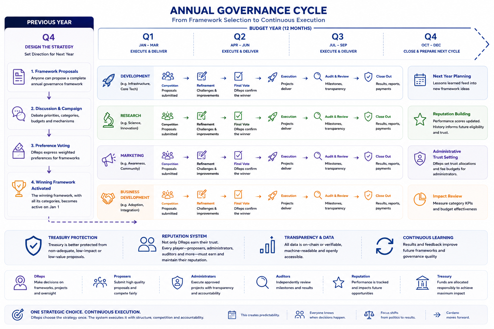

# Strategic Budget Governance for Cardano

## A Proposal for Scalable, Cost-Effective Treasury Governance

**Short read (~10 min):** [README-short.md](README-short.md) ([DE](README-short.de.md) · [JA](README-short.ja.md) · [KO](README-short.ko.md)) — problem, concept, annual cycle, and roles in one sitting.

---

## Overview

Cardano treasury governance works. The next step is making it **scalable and cost-effective** - so DReps decide direction without absorbing every operational role, and treasury spending consistently delivers ecosystem value for the funds committed.

This proposal also frees the Constitution to focus on what constitutions do best: **lasting, stabilizing constitutional elements** - roles, rights, guardrails, timelines, and accountability mechanisms that hold over time. Executive and operational rulings that must continuously adapt to markets, technology, and ecosystem conditions belong in annual frameworks instead, so strategy and execution can evolve without repeated constitutional amendments.

At a high level, this concept proposes:

* **Set annual priorities and categories first** - DReps choose a strategic framework for the budget year, not hundreds of unrelated proposals at once
* **Run competitive procurement inside those categories** - vendors compete within shared scopes, lanes, and KPIs
* **Make proposals comparable** - structured templates with human-readable narrative and machine-readable fields
* **Surface proposer co-funding** - every treasury withdrawal declares what share of the project budget comes from treasury versus proposer contribution
* **Require strong disclosure** - conflicts of interest and third-party relationships declared before votes
* **Always include treasury retention** - Option 0 (no award) competes with every funding decision
* **Separate roles** - strategists (DReps), executors (vendors), operators (administrators), verifiers (auditors) under constitutional guardrails

The sections below develop this into a full operational model. For adoption timing, pilot options, staged rollout, and collaborative next steps, see [Path Forward](docs/path-forward.md).

---

## About This Document

This README is a **raw concept draft** - concrete enough to test whether experienced DReps would support a fundamental rethink of treasury governance, yet intentionally incomplete in operational detail.

**Collaborative drafting is the main goal of this project.** The author prepared this text to open discussion, not to deliver a finished reform. If the direction finds support, the next stage should bring more DReps directly into workshops, review, and fine-tuning.

**Layered presentation:** [README-short.md](README-short.md) is the ~10-minute entry point; the Overview above orients readers inside this document; the narrative below walks from motivation through design to adoption. [Document Structure](docs/document-structure.md) explains how this material may split into separate files as the concept matures.

---

## Document Guide

| Part | Sections |
| ---- | -------- |
| **I - Context** | [DRep Summary](#drepresentative-summary) · [Why Change?](#why-change) · [Decentralized Decisions](#decentralized-decisions-not-central-planning) |
| **II - Principles** | [Core Principles](#core-principles) · [Constitutional vs Operational](#constitutional-layer-vs-operational-layer) · [Scope](#separation-from-other-governance-actions) |
| **III - Annual Model** | [Framework Selection](#annual-governance-framework-selection) · [Categories](#category-definition) · [Governance as Data](#governance-as-data) · [Treasury Share & Co-Funding](#treasury-share-and-proposer-co-funding) · [Preference Voting](#preference-voting) · [Quarterly Competitions](#quarterly-category-competitions) · [Refinement & Challenges](#refinement-and-confirmation) |
| **IV - Roles** | [Vendors](#vendors) · [Administrators](#administrators) · [Auditors](#auditors) |
| **V - Treasury & Infrastructure** | [Lobbying](#lobbying-transparency) · [Treasury Protection](#treasury-protection) · [Business Logic Layer](#governance-business-logic-layer) · [Governance Minimization](#governance-minimization) |
| **VI - Adoption** | [Transition](#transition-opportunity) · [Benefits](#benefits-by-participant) · [Risks](#risks-and-safeguards) · [Conclusion](#conclusion) |

---

# Part I - Context and Motivation

# DRepresentative Summary

Cardano governance has successfully decentralized decision making.

The introduction of DReps, constitutional governance, treasury withdrawals, and delegated voting established a foundation that many blockchain ecosystems have not yet achieved.

The next challenge is scalability and responsible stewardship of treasury funds.

How can thousands of ADA holders, hundreds of DReps, administrators, auditors, vendors, and future ecosystem participants make strategic decisions without drowning in operational complexity?

How can treasury governance become understandable not only for governance specialists, but also for ordinary ADA holders, ecosystem contributors, companies, and future partners?

How can governance retain flexibility while improving accountability?

How can every ADA spent from the treasury create clear, measurable value for the ecosystem?

This proposal suggests that Cardano should begin evolving from a proposal-centric governance model toward a strategic budget governance model inspired by lessons from:

* Cardano governance
* Catalyst
* Tezos governance
* Polkadot governance
* Optimism retroactive funding
* Public procurement systems
* Corporate budgeting processes
* Direct democratic systems
* Digital nation-state concepts

Rather than asking DReps to simultaneously act as strategists, procurement officers, auditors, project managers, and budget controllers, the proposed framework separates these responsibilities into specialized and competitive roles operating within constitutional guardrails.

The result is intended to create a governance system that becomes:

* Easier to understand
* Easier to participate in
* Easier to audit
* Easier to automate
* Easier to scale
* More disciplined about value for money

The objective is not to replace Cardano governance, but to provide a more structured, scalable, and cost-effective framework for treasury-funded ecosystem development - where spending is justified by outcomes, not by activity alone.

This creates a path from governance experimentation toward governance maturity.

---

---

# Why Change?

The current governance framework successfully enables treasury spending.

However, experience has demonstrated several recurring challenges:

* DRep overload
* Proposal overload
* Inconsistent proposal quality
* Limited accountability mechanisms
* Weak institutional memory
* High operational complexity
* Difficulty comparing proposals
* No structured signal for proposer co-funding - nearly all requests ask for full treasury funding, often with a security margin, with no rankable metadata for treasury share
* Lack of structured strategic planning
* Weak execution accountability for funded projects
* Ambiguous budget phase boundaries under Net Change Limit (NCL) rounds
* NCL budget lock when large approved projects under-deliver

Experience with budget allocation so far has exposed a recurring execution gap. Funded proposers have sometimes unilaterally redefined project scope or deliverables after approval, or failed to deliver agreed outcomes in part or entirely. When an independent administrator withheld milestone payments, that was appropriate - but when a proposer who declared themselves as administrator simply returned unspent funds shortly before applying in the next NCL round, the ecosystem gained little durable accountability. Partial repayment must not substitute for delivery. Non-delivery and unilateral scope changes should carry significant consequences for the proposer and for the next budget year - not a soft reset between flexible funding rounds.

Treasury budget allocation today operates through NCL rounds rather than fixed annual cycles. Each NCL can be replaced by the next NCL at any time. In practice this provides little stable orientation for DReps, proposers, or administrators planning multi-quarter work. Participants struggle to know which budget envelope is active, when it ends, or how current commitments relate to the next round. The phase boundary is flexible rather than predictable, which adds confusion rather than useful structure.

The current NCL model and the first two years of experience exposed a further problem. Proposers with significant approved budgets have often failed to deliver fully or to get milestones signed off for a noticeable share of their project volume. Yet those amounts were already deducted from the NCL envelope and could not be reassigned to other proposers or projects. This creates a blocking, denying effect: treasury capacity appears consumed while value remains undelivered, and no one knows until late in the cycle how much a proposer may still deliver versus what will fall short. That is not only a breach of promised deliverables; it also inflicts economic harm on other ecosystem participants who were turned away because they did not fit within NCL limits.

Many governance discussions focus on improving proposal assessment.

A more fundamental question may be:

**Are DReps being asked to perform too many different jobs simultaneously?**

Most large organizations separate:

* Strategic planning
* Budget allocation
* Procurement
* Administration
* Auditing
* Execution

Cardano governance currently places much of this burden directly on voters.

This does not scale.

This proposal focuses on reducing governance complexity by introducing structure.

This creates scalability. DReps can focus on direction rather than administration and continuous/mass assessments.

---

# Decentralized Decisions, Not Central Planning

Some readers may interpret annual frameworks, categories, sub-budgets, and project slots as central planning - reminiscent of a government ministry running an annual budget and procurement process.

That reaction is understandable. But it misreads what this concept to make Cardano governance more viable actually aims to be: decentralized governance with no central authority. This proposal should not introduce one.

The framework borrows elements from common procurement and administrative processes - because those patterns are effective and proved at scale - but arranges them so DReps retain decision-making options at every relevant stage of the annual sequence.

See [Procurement & Budget Process Comparison](docs/procurement-comparison.md) for how typical business and public procurement elements map to this framework across jurisdictions such as the USA, Germany, Italy, UK, India, Japan, and Ethiopia.

Less governance is not the goal. The goal is to apply familiar, effective operative and administrative processes in a decentralized way - without drowning treasury governance in chaotic inefficiency.

This means:

* More predictability - a known annual sequence instead of ad-hoc timing
* More competition - between frameworks, vendors, administrators, and auditors
* Better comparability - proposals evaluated within a shared structure
* Clearer decision layers - each vote answers one question at a time

The problem today is not simply that every treasury proposal invents its own process. More often, completely different proposals appear at the same time and cannot be meaningfully compared. Worse, proposals that are broadly similar - and should be compared side by side - arrive with different structures, different conditions, or different assumptions, making fair evaluation difficult.

DReps face a further constraint: once a proposer submits, DReps have up to six epochs to assess and vote - without knowing whether a stronger or better-structured proposal will appear soon after. Every vote carries uncertainty about what was missed or what is still coming.

This concept aims to keep proposals aligned and structured so DReps can make better decisions. It achieves that through rules - but those rules do not act as central power. They define the playing field; the decisions themselves always remain in DReps' hands.

Under this model:

* Process becomes standardized and repeatable
* Competition increases between frameworks, vendors, administrators, and auditors
* DRep workload decreases because each decision layer answers one question at a time
* Operational complexity moves into predefined rules rather than ad-hoc debate

The structure exists to reduce the number of unrelated questions DReps must reconcile at once, not to expand the power of any single governance actor.

This creates simplicity. Structure replaces chaos rather than adding layers on top of it.

The objective is a **fairer and more realistic procurement system** for treasury-funded work - balancing ecosystem needs, DRep oversight, and competitive delivery. Rules should not favor incumbents by default, nor extend vendor runway beyond what approved deliverables justify. Outcome-based categories, Option 0, structured comparison, and execution accountability serve that balance. Wording throughout this document aims to describe structural incentives rather than attribute bad faith to any participant.

---

# Part II - Principles and Architecture

# Core Principles

## Governance Should Focus on Strategy

DReps should primarily decide:

* Strategic priorities
* Budget allocations
* Administrative trust
* Project selection

DReps should not be expected to manage projects directly.

Strategic focus must not become an excuse for the proposing or administering side to take over how execution is defined and ruled. Proposers and administrators must not unilaterally set the operational terms the ecosystem must accept - including timelines, voting mechanisms, self-defined pre-elections, or alternative-less definitions and conditions embedded in their own submissions.

Execution rules belong in the shared annual framework and constitutional guardrails, not in bespoke attachments to individual proposals. DReps vote on strategy and trust; they should not be asked to approve process designs that proposers define unilaterally in their own submissions.

This creates clarity. Strategic decisions remain with voters; execution structure remains open to competition and DRep choice.

---

## Governance Should Be Predictable

Governance should operate according to a known annual cycle.

Participants should know:

* When framework proposals open (Q4)
* When DReps rank-vote on the annual framework (Q4)
* When administrator trust is reallocated (Q4)
* When category projects compete (quarterly)
* When refinements and confirmations occur
* When audits happen

The current NCL-based approach illustrates the opposite: budget phases are not tied to a calendar year, and each round may supersede the previous one without a fixed handover. This proposal replaces that ambiguity with an explicit annual cycle so participants can plan, compare, and hold funded work accountable across a known budget year.

This creates predictability. Everyone knows when decisions happen.

---

## Treasury Funds Should Compete Against Treasury Retention

Every funding competition should automatically include:

**Option 0: No Award / Treasury Retention**

Proposals should not compete only against each other.

They should compete against keeping the funds in the treasury.

This creates treasury protection. Spending must be justified.

---

## Treasury Support Should Reflect Proposer Commitment

Treasury funds are one source of project finance - not the only one.

Proposers may bring partial funding: cash, in-kind resources, third-party grants, or matched contributions at milestones. When they do, that commitment is a legitimate competitive signal. DReps should be able to see and compare it rather than infer it from narrative text.

Requesting 100% treasury funding remains valid. The objective is not to penalize full-funding requests by default, but to make treasury share a **structured, filterable field** on every withdrawal request so comparable proposals can be evaluated side by side.

See [Treasury Share and Proposer Co-Funding](#treasury-share-and-proposer-co-funding) for field definitions and verification expectations.

This creates comparability. Proposer commitment becomes visible before voting, not only after delivery failure.

---

## Governance Should Create Institutional Memory

Execution history, success, and failure all matter. Partial fund returns, withheld milestone payouts, and voluntary repayments before a new funding round must not erase a poor delivery record. The ecosystem should remember performance through transparent reputation systems that carry forward into the next budget year. Full reputation mechanics may follow in a later phase once core procurement flow is stable (see [Path Forward](docs/path-forward.md)).

This creates accountability. Performance becomes visible over time.

---

## Governance Should Leverage Competition

Competition should exist between:

* Governance frameworks
* Vendors
* Administrators
* Auditors

The system should rely on aligned incentives wherever possible.

This creates resilience. No single actor becomes indispensable.

---

# Constitutional Layer vs Operational Layer

A fundamental principle of this proposal is the separation between constitutional governance and operational governance.

The Constitution should define:

* Roles
* Responsibilities
* Rights
* Constraints
* Timelines
* Treasury guardrails
* Governance processes
* Accountability mechanisms

The Constitution should not attempt to define how ecosystem priorities must be executed.

Instead, annual governance frameworks define the operational execution model for a specific budget year.

The Constitution provides the guardrails.

The selected annual framework defines the categories.

The categories define the operational processes.

This separation allows the ecosystem to continuously adapt priorities and execution models without requiring constant constitutional amendments.

This creates flexibility. Strategy evolves while constitutional stability remains intact.

---

# Separation From Other Governance Actions

This proposal only addresses treasury and budget governance.

Other governance actions remain unaffected and continue through their existing processes - for example constitutional amendments, informational actions, parameter changes, and hard fork governance actions.

Those other governance action types face **their own challenges** (including technical review capacity, expert assessment, and decision clarity). They may also need fundamental improvement over time. That work is **outside the main scope of this project**, which focuses on treasury allocation and budget governance architecture. Acknowledging those gaps does not dilute this proposal; it clarifies where attention is directed.

Budget governance should be viewed as a specialized governance layer focused on treasury allocation.

This creates clarity. Strategic treasury planning does not interfere with protocol governance, while parallel improvements to other governance types can proceed independently.

---

# Part III - Annual Budget Model

# Annual Governance Framework Selection

The annual budget year in this model is deliberately fixed and calendar-aligned - in contrast to today's NCL rounds, which can be superseded at any time and offer little stable orientation for planning or accountability.

At the beginning of Q4, anyone may submit a complete governance framework for the upcoming budget year. There is no appointed committee, working group, or coalition that pre-selects which frameworks DReps may choose from. A significant time-locked deposit should prevent spamming and flooding this phase. 

Framework authors compete openly. DReps assess the submitted frameworks and express ordered preferences through ranked voting. The framework receiving the strongest collective preference becomes active for the following budget year.

A framework proposal defines:

* Categories
* Category descriptions
* Success criteria
* Budget allocations
* Administration models
* Auditor models
* Project size classes
* Reporting expectations
* Retroactive funding allocations

The winning framework, with all its categories, becomes active for the following budget year.

Categories are therefore not permanent governance structures.

Each year the ecosystem may select an entirely new strategic structure while remaining inside constitutional guardrails.

---

## Framework Authors as a First-Class Role

Framework proposals are not anonymous submissions. They are complete strategic blueprints that shape the entire budget year.

Whoever designs a framework defines:

* Which battlefields exist (categories)
* How budgets are distributed
* What success looks like (KPIs)
* How administration and auditing operate

The Constitution should require every framework proposer to submit a standardized, human- and machine-readable disclosure template - identical in structure for all proposers. Required fields include:

* Identity of the proposer and contributing team
* Commercial or strategic interests that may influence the framework design
* Rationale for proposing this specific framework structure
* Direct and indirect conflicts of interest
* Prior frameworks proposed or executed, where applicable

Framework authors compete on merit and transparency, not on privileged access to the selection process. DReps and their tools can compare frameworks and disclosures consistently because every submission uses the same template.

This creates accountability. The people who shape the annual battlefield are visible, and their interests are declared before voting occurs.

---

## Distributed Power Across Annual Decisions

A framework vote determines categories, budgets, KPIs, and operational models for one budget year. That is a significant decision - but it does not concentrate all governance power in a single moment or entity.

The model deliberately separates decision types across roles and timelines:

| Decision | Who proposes | Who decides | When |
| -------- | ------------ | ----------- | ---- |
| Annual framework | Any participant (Q4 submission) | DReps via ranked preference vote | Q4, for the upcoming budget year |
| Administrator trust | Administrators demonstrate performance | DReps via trust allocation vote | Q4, after current-year admin work is observable |
| Treasury guardrails | Constitutional amendment process | Existing constitutional governance | Any time, independent of the annual budget cycle |
| Category projects | Vendors | DReps via quarterly preference votes | Throughout the budget year |
| Auditors | Auditors register and offer services | DReps at final project confirmation | Per project, after refinement |

Administrator trust allocation is intentionally timed for direct feedback at year-end. DReps observe how administrators performed during the current budget year before allocating trust for the next. The Q4 vote takes place after most administrative work for the year is complete and refreshes trust allocation before the new budget year begins.

Treasury guardrail parameters - spending limits, runway requirements, emergency reserves - belong to the Constitution. They are amended through the standard constitutional process and may be initiated at any time. They are not aligned with, dependent on, or part of the annual budget framework selection.

This creates adaptability. The ecosystem can evolve without redesigning governance itself.

---

## No Alternativeless Roles

Power in this model is distributed across competing proposers on one side and DReps with their delegating ADA holders on the other.

* Framework designers propose complete annual strategies - they do not define the only available process
* Project proposers compete within category lanes - they do not set their own rules
* Administrators compete for DRep trust - no single administrator defines how all others must operate
* Auditors register and compete on expertise and pricing - verification is a market, not a monopoly

No role should be self-defining and unavoidable. The ecosystem must never arrive at a state where one administrator designs their operational model and all participants must accept it without competitive alternatives.

Every proposing side competes. Every deciding side votes. Neither side can permanently entrench itself outside constitutional guardrails.

This creates balance and resilience. Strategic direction is chosen democratically without creating permanent, unchallengeable governance actors, or risks from single actuators that suddenly become point of failures.

---

# Category Definition

Each category functions as a temporary operational charter for a single budget year.

Anyone proposing an annual framework - including its categories and their internal operational charters - must convince DReps to adopt it. DReps are not approving abstract design documents; they are choosing the rules, timelines, and decision sequences they will work within for the entire budget year. A framework that is confusing, burdensome, or poorly structured will struggle to win support, because DReps know they must live with the consequences.

Any attempt to propose a framework that unilaterally predefines too much in certain directions - locking in outcomes, processes, or actors before DReps can meaningfully choose - will probably not win support. DReps will recognize that such designs directly limit their decision-making power, and will prefer frameworks that preserve competitive choice at each stage of the annual sequence.

Categories may define:

## Purpose

What the category exists to achieve.

## Scope

Which proposals are eligible.

## KPIs

How success is measured.

## Budget

Allocated percentage of annual treasury spending.

## Funding Structure

Examples:

* One strategic project
* One large and two medium projects
* Quarterly competitions
* Continuous submission

## Execution Cadence

Category definitions may also specify how competition and allocation are spread across the budget year:

* **Four quarterly rounds** - separate voting and funding in Q1, Q2, Q3, and Q4
* **Two half-year periods** - separate voting and funding twice during the year
* **One full-year round** - a single competition for the entire category budget

This is a structural trade-off, not merely a scheduling preference.

A category executed only once - for example, entirely in Q1 - is effectively a tender for exactly one winning and executed proposal. It suits a very concrete scope and deliverables description: one winner, one execution path, one budget envelope.

The more a category is split into two or four parts, the more voting rounds it creates and the more winning proposals it can fund over the year. Each round draws from only a fraction of the total category budget. That mathematically caps the maximum amount any single winning proposal in that round can request.

Framework proposers must convince DReps that their chosen cadence fits the category's purpose. DReps weigh whether they want one large, focused award or several smaller, recurring selection rounds with lower individual ceilings.

## Administration Requirements

Expected reporting and oversight standards.

## Retroactive Funding Allocation

Optional rewards for demonstrated value creation.

## Tender-Based Categories

Categories may define highly specific objectives and deliverables.

In such cases the category effectively becomes a competitive tender process.

Proposers compete by offering:

* Execution plans
* Teams
* Budgets and [treasury funding ratio](#treasury-share-and-proposer-co-funding)
* Timelines
* Governance structures

DReps indirectly approve this procurement model when selecting the annual framework containing such categories.

Tender-based categories carry a specific design risk. A category definition that prescribes a particular implementation - "build feature X using architecture Y within six months" - may appear neutral while disproportionately favoring one vendor's existing solution.

Wherever possible, tender categories should define **outcomes** rather than **implementations**:

* Desired ecosystem result
* Measurable success criteria
* Constraints and boundaries

not:

* Specific technology choices
* Named architectures
* Pre-engineered procurement outcomes

Governments struggle with this constantly. Outcome-based definitions preserve competitive fairness while still allowing structured procurement when DReps explicitly choose it.

This creates flexibility. Categories can range from open innovation to highly structured procurement without becoming vendor-specific lock-in.

---

# Governance as Data

This proposal represents a shift from governance-as-documents to governance-as-data.

Current treasury governance often asks DReps to read dozens of PDFs, forum threads, videos, and narrative essays - then synthesize judgment from unstructured text.

The proposed model asks participants to work with structured, queryable governance objects:

* Framework definitions with explicit budget fields
* Category charters with declared KPIs
* Proposals with dedicated cost, team, deliverable, and [treasury funding ratio](#treasury-share-and-proposer-co-funding) fields
* Reputation scores, transparency levels, and audit registrations as machine-readable attributes

A DRep should be able to say:

> Show only proposals with transparency above 80%, reputation above 40%, treasury funding ratio at or below 75%, and complete cost breakdowns.

and have wallets, portals, or AI-assisted tools filter hundreds of proposals instantly.

That is impossible when governance relies primarily on essays.

Every governance artifact should be simultaneously human-readable and machine-readable. That dual format is a core scalability mechanism aligned with Cardano's engineering culture, not an optional formatting layer.

This creates scalability. Governance becomes queryable, filterable, and tool-assisted rather than document-interpretation at scale.

---

# Treasury Share and Proposer Co-Funding

Current Cardano treasury governance has little structured relevance to proposers who bring partial funding and request only a percentage of support from the treasury. "Skin in the game" at submission time - value transferred or committed by the proposer before treasury disbursement - practically does not exist as comparable metadata. Nearly every proposer requests full funding, many with a security margin above estimated need.

This proposal treats **treasury funding ratio** as rankable, filterable metadata on every treasury withdrawal (TW) request - whether submitted through structured category competitions or any direct withdrawal path.

## The Signal

| Concept | Definition |
| ------- | ---------- |
| **Total project budget** | Full cost to deliver the approved scope |
| **Treasury requested** | ADA amount requested from the Cardano treasury |
| **Treasury funding ratio** | `treasury_requested ÷ total_project_budget` - a value from greater than 0 up to 100% |
| **Proposer contribution** | Funds or resources the proposer commits outside the treasury request |

A proposal requesting 400,000 ADA for a 500,000 ADA project has a treasury funding ratio of 80%. The proposer contribution is 100,000 ADA (or equivalent in-kind value, declared separately).

DReps may filter, sort, or weigh proposals by this ratio within a category lane. A lower ratio is not automatically better, but it is a useful comparison dimension alongside cost, team, reputation, and deliverables.

## Required Metadata Fields

Every TW request should declare, in human- and machine-readable form:

* `total_project_budget_ada`
* `treasury_requested_ada`
* `treasury_funding_ratio` (computed; stored for query consistency)
* `proposer_contribution_ada`
* `contribution_type` - cash, in_kind, third_party_grant, or mixed
* `contribution_timing` - upfront, milestone_matched, or at_completion
* `contribution_verification` - none, attestation, escrow, or on_chain_lock

Narrative explanation remains required: what the proposer contributes, when it is committed, and how it relates to delivery risk.

## Verification and Abuse Resistance

Declared co-funding is only as credible as its verification path.

* **Cash contributions** are strongest when locked in escrow or released milestone-for-milestone alongside treasury disbursement
* **In-kind contributions** (team time, infrastructure, licenses) should be quantified and auditable; they are easier to overstate
* **Third-party grants** should name the source and confirmation status
* **Milestone-matched** contributions should bind treasury releases to verified proposer payments

Co-funding at submission does not replace [delivery accountability](#delivery-accountability). It signals commitment before approval; execution accountability applies after approval.

## Category-Level Policy (Optional)

The annual framework may set category-specific expectations without making co-funding a global constitutional requirement:

* Maximum treasury funding ratio for a lane (for example, innovation micro-grants capped at 80% treasury share)
* Preference weighting in evaluation guidance (DRep portals may highlight proposals below a threshold)
* Tender categories where proposers explicitly compete on execution **and** funding structure

100% treasury requests remain eligible unless a category charter explicitly states otherwise.

## Relation to Other Mechanisms

* **Option 0** - treasury retention competes against spending; co-funding metadata helps DReps judge whether a partial award or no award is better value
* **Refinement** - treasury funding ratio and contribution terms may be renegotiated during challenge and refinement
* **Reputation** - verified co-funding delivery can strengthen standing; overstated contributions that fail verification should weaken it

See [Procurement & Budget Process Comparison - Co-financing](docs/procurement-comparison.md#co-financing-and-cost-sharing) for how public grant and procurement systems handle comparable requirements.

This creates leverage visibility. Treasury support becomes a measurable share of project finance rather than an implicit full subsidy.

---

# Preference Voting

Governance should evolve beyond simple:

* Yes
* No
* Abstain

DReps should be able to express ordered preferences between competing options.

Possible implementations include:

* [Ranked Choice Voting](docs/preference-voting.md#method-1-ranked-choice-voting-rcv--instant-runoff) (Instant Runoff)
* [Condorcet methods](docs/preference-voting.md#method-2-condorcet-methods)
* [Schulze method](docs/preference-voting.md#method-3-schulze-method)

See [Preference Voting Methods](docs/preference-voting.md) for a detailed comparison of how these methods work, when to use each, and recommended implementation phases.

**Time-weighted preference** may complement ranked voting for some decisions: delegation or vote weight that reflects sustained participation over time can reduce short-term campaigning and reward long-term engagement. This is noted as a possible extension, not a requirement for first adoption.

The voting layer should stay **narrow and fit-for-purpose**. Cardano needs methods that work reliably for multi-option treasury decisions and balance stakeholder power - not an open arena for every experimental mechanism (seeking a trial ground). New methods should enter only when they solve a clearly identified gap in the core set above. See [Path Forward](docs/path-forward.md) for phased rollout.

Preference voting applies to multi-option decisions such as Q4 framework selection and quarterly category competitions. Administrator trust allocation uses weighted distribution, not winner-take-all ranking. Post-refinement confirmation votes on a single proposal may remain threshold-based.

DRep tools may sort or annotate competing options by [treasury funding ratio](#treasury-share-and-proposer-co-funding) before or during preference expression. The voting method itself need not hard-code ratio weighting - visibility and filterability are the first step.

If native support is unavailable initially, off-chain systems such as Ekklesia may provide a transition path or become a permanent off-chain mechanism.

This creates better signal quality. Voters express priorities rather than binary positions.

---

# Quarterly Category Competitions

Once the annual framework is approved, categories operate independently.

Category subdivision lets DReps participate and influence outcomes where they feel competent, with no effect on proposals in other categories. In today's mixed setting, unrelated proposals share a single ballot: whether a DRep votes yes, no, or abstain, their choices on topics outside their competence still influence the relative results of other proposals on that ballot.

Each quarter:

* Proposals are submitted
* Challenge periods open
* Refinement occurs
* Preferred proposals are selected

The quarterly cycle determines prioritization.

It does not determine project duration.

Projects may execute for up to twelve months.

Proposal templates therefore include:

* Planned duration
* Expected completion date
* Multi-year project flag
* [Treasury funding ratio](#treasury-share-and-proposer-co-funding) and proposer contribution

If a proposal represents only one phase of a larger initiative, this must be explicitly declared.

Future phases are never automatically approved.

They must compete again within future governance cycles.

The multi-year flag creates **no rights** for future funding. It does not imply priority, expectation, or commitment. Phase 1 approval does not mean Phase 2 is implied. Every phase competes independently in its own governance cycle.

Some readers may assume that declaring a multi-year initiative secures a funding pipeline. It does not. The flag exists only to make long-term intent visible so DReps can assess scope and dependency risk before voting.

This creates transparency. Long-term commitments become visible without binding future treasury decisions.

---

# Refinement and Confirmation

The first vote identifies the preferred proposal.

The proposal then enters:

* Challenge
* Clarification
* Combination
* Refinement

During this phase:

* Budgets may be improved
* [Treasury funding ratio](#treasury-share-and-proposer-co-funding) and proposer contribution terms may be adjusted - for example, a proposer increases co-funding after a budget challenge
* Deliverables clarified
* Similar proposals merged
* Risks reduced

After refinement, a second DRep confirmation vote is required.

This confirmation vote is integral - it ratifies the refined proposal together with the responsible auditor or auditor set and final funding terms. Auditor selection is not a separate step after DRep approval.

Only proposals achieving the required support threshold after refinement become eligible for funding.

This creates accountability. Proposers must take challenges and feedback seriously.

---

# Structured Challenge Process

Before final approval, proposals enter a formal challenge period.

Challenges may include:

* Technical concerns
* Budget concerns
* Feasibility concerns
* Duplication concerns
* Conflict-of-interest concerns

Challenges must be:

* Public
* Attributable
* Evidence-based

After final approval, routine challenges are considered closed.

Only fraud, deception, contractual breaches, or similar serious issues may reopen review.

---

## Challenger Credibility

Competitors may file repeated low-substance challenges to delay stronger proposals - submitting many weak objections to create noise rather than insight.

The challenge system should therefore track challenger credibility over time:

* Useful, evidence-based challenges that surface genuine concerns build challenger reputation
* Repeated frivolous or unsubstantiated challenges degrade challenger credibility
* Low-credibility challengers may face reduced weight or procedural scrutiny

This creates accountability on both sides. Vendors face scrutiny during defined windows, and challengers face consequences for abuse.

This creates finality. Governance can move from debate to execution.

---

# Funding Slots

Categories may define multiple funding lanes.

Example:

Marketing Category

* Large Slot: 60%
* Medium Slot: 30%
* Small Slot: 10%

Projects only compete within their own lane.

Small projects are not forced to compete against strategic initiatives.

This creates fairness. Comparable proposals compete against comparable proposals.

---

# Newcomer Lanes

The framework should preserve opportunities for new participants.

Possible structure:

* Micro
* Small
* Medium
* Large
* Strategic

Large projects may require reputation.

Small project lanes remain open to newcomers, and can avoid complex requirements of large project workflows.

This creates opportunity. Innovation is not restricted to established organizations.

---

# Human and Machine Readable Governance

See also [Governance as Data](#governance-as-data) for the strategic rationale behind structured governance artifacts.

Governance artifacts should be both:

* Human readable
* Machine readable

Proposal templates should be structured data objects rather than primarily narrative documents.

Examples of dedicated fields:

* Total project budget and treasury requested amount
* Treasury funding ratio and proposer contribution (see [Treasury Share and Proposer Co-Funding](#treasury-share-and-proposer-co-funding))
* Team size
* FTE allocation
* Hourly rates
* Duration
* Deliverables
* Dependencies
* Milestones
* Transparency level
* Prior reputation

Descriptive text remains important but should complement structured fields rather than replace them.

This enables:

* Wallet integrations
* Governance portals
* Explorer integrations
* Analytics tools
* AI-assisted assessment
* Custom DRep filtering

DReps should be able to define their own evaluation criteria.

For example:

> Show only proposals with transparency above 80%, reputation above 40%, treasury funding ratio at or below 75%, and complete cost breakdowns.

This creates scalability. Humans focus on judgment while tools assist with analysis.

---

# Part IV - Roles and Accountability

# Vendors

## Transparent Identity

Vendors may select different transparency levels.

### Level 1

Pseudonymous participation.

### Level 2

Public team disclosure.

### Level 3

Full organizational disclosure.

Higher budget classes may require higher transparency.

---

## Vendor Reputation

Reputation is earned through execution.

This module is central to long-term accountability but need not block first adoption. A practical path is to **integrate reputation as staged evolution in year 2+** once the core annual framework, structured procurement, and delivery verification are operating. See [Path Forward](docs/path-forward.md).

Factors may include:

* Successful delivery
* Timely delivery
* KPI achievement
* Closure approval
* Failed or partial delivery
* Unilateral scope or deliverable changes after approval
* Milestone withholdings, incomplete execution, or fund returns before re-applying
* Budget class and project complexity

Reputation must not be accumulated through volume alone. A vendor completing fifty micro-projects with minimal ecosystem value should not accumulate the same standing as a vendor delivering a single large infrastructure initiative.

Reputation weighting should reflect:

* Budget class (micro, small, medium, large, strategic)
* Project complexity
* Success rate within each class

A successfully delivered five-million-ADA infrastructure project should count differently than a ten-thousand-ADA documentation task.

Reputation operates within a rolling time window.

Older performance gradually loses weight.

Reputation remains capped.

The objective is measuring current trustworthiness rather than creating permanent status.

Reputation affects eligibility, not voting power.

Poor delivery should materially affect vendor standing, eligibility for larger budget classes, and DRep assessment when the same proposer returns in a later cycle. Returning unspent funds does not reset accountability; it is one signal within a persistent execution record.

This creates accountability without creating governance aristocracies.

---

## Delivery Accountability

Approved deliverables are commitments, not suggestions.

Proposers must not unilaterally redefine scope, milestones, or KPIs after funding without a formal DRep-visible process. When delivery falls short, consequences must be meaningful for both the proposer and the next budget year:

* Milestone-based treasury releases remain withheld until independent verification confirms delivery
* Reputation and eligibility reflect partial failure, non-delivery, and post-approval scope changes
* DReps can weigh execution history when the same vendor competes again - including in larger lanes or strategic categories
* Voluntary repayment of unspent funds or self-administered milestone withholding does not clear the record before the next budget cycle

When a proposer also acts as administrator, that dual role must not become a path to avoid delivery accountability: returning funds shortly before the next NCL or budget round must not substitute for delivering what was approved.

This creates post-award accountability - distinct from [proposer co-funding at submission](#treasury-share-and-proposer-co-funding), which signals commitment before approval. Execution failures follow the proposer into the next budget year rather than disappearing between flexible funding rounds.

---

## Vendor Capacity Limits

Identified vendors should be limited regarding:

* Simultaneous proposals
* Active projects
* Category participation
* Total treasury exposure

The objective is reducing execution risk and avoiding ecosystem dependency.

This creates diversity. Treasury opportunities remain distributed.

---

# Administrators

Administrators provide operational support.

Examples:

* Proposal coordination
* Milestone tracking
* Reporting
* Process management

---

## DRep Trust Allocation

DReps allocate trust across administrators separately from the Q4 framework selection vote. This vote occurs in Q4, once most administrative work for the current budget year is complete and DReps can assess quality before the next year begins.

The refreshed trust allocation takes effect at the start of the upcoming budget year.

Example:

* Intersect: 40%
* Administrator B: 35%
* Administrator C: 25%

Unlike current systems, administrators should not primarily depend on project proposers for compensation.

Instead, a predefined administrative budget is allocated according to DRep trust.

Trust allocation therefore determines:

* Operational capacity
* Administrative funding

---

## Capacity Matching

DReps will reasonably ask: what happens if an administrator receives 60% trust allocation but can only handle 30% of projected proposal volume? Or if an administrator receives trust but no proposers select them?

The mechanism should work as follows:

* Each winning proposal selects an administrator from those available
* An administrator may accept proposals up to their trust allocation, with a defined flexibility tolerance (for example ±10%)
* If demand exceeds an administrator's capacity, excess proposals queue or redirect according to predefined rules
* If an administrator receives trust but insufficient proposal uptake, their allocated administrative budget reflects actual utilization

Proposers choose their administrator, but DReps observe the consequences. Poor transparency, weak close-out reports, and low administrative quality should reduce trust in the following year.

This reduces conflicts of interest between administrators and proposers.

Administrators become accountable primarily to DReps.

This creates alignment. Administrators compete for trust rather than projects.

---

# Auditors

Auditors are independent from both vendors and administrators.

Auditors provide:

* Milestone verification
* Delivery assessment
* KPI review
* Completion confirmation

Auditors publicly register:

* Expertise areas
* Category specialization
* Availability
* Pricing structure

Examples:

* Fixed fee
* Percentage fee
* Milestone fee

Auditors register and offer services before the confirmation vote. DReps approve the responsible auditor or auditor set as part of the final confirmation vote - together with the refined proposal and funding terms.

During execution, milestone cycles include:

* Reviews (delivery and KPI verification by auditors)
* Payments (milestone-based treasury releases)
* DRep quality feedback (ongoing performance signals for closure and reputation)

---

## Auditor Rotation and Market Diversity

Auditors, like administrators, become a potential capture vector. Vendors may prefer friendly auditors. A small set of auditors may dominate milestone reviews over time.

The framework should encourage:

* Auditor rotation across projects and categories
* Competitive auditor markets with transparent pricing and expertise registration
* Separation between vendors, administrators, and auditors within the same category

Rotation need not be mandatory initially, but the constitutional layer should discourage long-term auditor-vendor pairing that reduces independent verification.

This creates verification markets. Expertise becomes transparent and competitive.

---

# Part V - Treasury and Infrastructure

# Lobbying Transparency

Lobbying exists in every governance system.

The objective should be transparency rather than prohibition.

DReps may voluntarily publish interaction signals.

Examples:

* L1: Contacted
* L2: Advocacy
* L3: Requested voting behavior
* L4: Material incentive suggested

The purpose is visibility rather than enforcement.

Transparency itself becomes a governance defense mechanism.

This creates accountability. Influence becomes visible.

---

# Treasury Protection

Treasury preservation should become a constitutional objective.

Potential safeguards include:

* Maximum annual spending limits
* Treasury runway requirements
* Emergency reserves
* Spending growth limits

These guardrail parameters live in the Constitution and are amended through the standard constitutional governance process. They may be proposed and voted on at any time. They are not part of, aligned with, or dependent on the annual framework selection in Q4.

A limited Q3 adjustment window may allow moderate budget revisions within predefined boundaries for the active budget year.

Unused budgets return to the treasury.

No category is required to spend its entire allocation.

This creates sustainability. Treasury longevity becomes a design goal.

---

# Direct Treasury Withdrawals

The ecosystem must decide whether direct treasury withdrawals remain available.

Potential approaches include:

1. Budget framework only
2. Budget framework plus unrestricted withdrawals
3. Budget framework plus restricted exceptional withdrawals

Experience suggests that routine ecosystem funding should ideally flow through structured budget governance.

Whichever path remains available, every treasury withdrawal should use the same [treasury funding ratio metadata](#treasury-share-and-proposer-co-funding) so DReps can compare exceptional requests with structured category proposals.

This remains an open governance question.

This creates an opportunity to balance flexibility with strategic discipline.

---

# Learning From Existing Systems

Cardano should not attempt to redesign governance in isolation.

Lessons should be actively studied from:

* Cardano governance
* Catalyst
* Tezos
* Polkadot
* Optimism
* Public procurement
* Corporate governance
* Cooperatives
* Direct democracy

The objective is to combine proven lessons rather than reinvent them.

This creates maturity. Governance evolves through learning.

---

# Governance Business Logic Layer

A long-term objective should be an open governance business logic layer.

Just as Cardano provides common ledger rules at Layer 1, governance should provide common governance primitives.

Examples:

* Framework registration
* Category definitions
* Proposal registration
* Preference voting
* Challenge submission
* Reputation updates
* Trust allocation
* Auditor registration
* Milestone approvals
* Structured discussion messages

These standards should be usable by:

* Wallets
* Explorers
* Governance portals
* Administration tools
* Auditor tools
* Voting platforms
* AI agents

The governance process should never depend on a single website, organization, or interface.

Whenever possible, these processes should leverage native Cardano Layer 1 capabilities.

Governance discussion should not remain scattered across forums, social media, and unstructured threads. The business logic layer should define a simple, limited, structured format for placing comments near governance objects - including category proposals, annual framework proposals, and submitted challenges.

DReps could submit short, size-limited messages designed to be easy to read at a glance. Each message would carry one of a small fixed set of types:

* **Note** - context or observation without a directional signal
* **Question** - a direct question to the proposer or challenge author
* **Pro endorsement** - explicit supportive signal
* **Con critique** - explicit critical signal

Identified proposers may respond within the same thread. Both the number of messages and the size of each message would be capped. The goal is readable signal, not open-ended debate volume.

The business logic layer should develop a data-availability approach for these messages: proposer- and DRep-signed short payloads, submitted according to a common schema and retrievable via an open API. This is not a centralized governance platform. Any wallet, explorer, portal, or app that implements the business logic layer specifications and message formats can display the same commentary alongside the same proposal - wherever participants choose to engage.

This creates interoperability. Many tools can participate in a shared governance ecosystem - and the same signed, structured discussion travels with each governance object instead of disappearing inside one website.

---

# Governance Minimization

The most scalable governance system is not the one with the most voting.

It is the one requiring the fewest decisions.

DReps should focus on:

* Strategy
* Priorities
* Budgets
* Trust

Operational activities should be delegated to competitive vendors, administrators, and auditors operating within constitutional guardrails.

This creates scalability. Human attention is reserved for high-value decisions.

---

# Part VI - Adoption and Review

# Transition Opportunity

The upcoming Q4 cycle presents an opportunity to begin experimenting with this model.

Not every component must exist immediately.

Initial adoption could include:

* Annual framework proposals
* Category definitions
* Preference-based framework selection
* Structured challenge periods
* Off-chain preference voting through Ekklesia

The ecosystem can evaluate the approach incrementally while preserving existing governance mechanisms.

Alternatively, the ecosystem may choose a **limited pilot** before broader adoption - or proceed directly toward full framework integration. Each path carries different timing and participation risks. See [Path Forward](docs/path-forward.md) for pilot design considerations, staged modules (including reputation in year 2+), collaborative drafting next steps, and legal SME review timing.

This creates a practical path forward. Evolution becomes possible without disruption.

---

# Benefits by Participant

A skeptical reader may ask: who actually benefits from this additional structure?

### ADA Holders

* Clearer ecosystem priorities through annual frameworks
* Easier delegation decisions when DReps focus on strategy rather than operational detail
* More predictable treasury spending cycles
* Transparent reputation and performance history for funded work

### DReps

* Fewer simultaneous decisions - each governance phase answers one question
* Structured, comparable proposals instead of unstructured document review
* Machine-readable tools for filtering and pre-assessment
* Reduced lobbying ambiguity through voluntary disclosure signals
* Focus on direction, budgets, and trust rather than project management

### Vendors

* Predictable funding cycles with known category scopes and KPIs
* Clear requirements scaled to project size
* Fair competition within funding lanes rather than against unrelated initiatives
* Reputation growth path from newcomer lanes to larger projects
* Option 0 ensures proposals must justify spending against treasury retention

### Administrators

* Stable mandate derived from DRep trust rather than proposer fees
* Transparent accountability through reporting quality
* Competitive market for operational excellence
* Reduced conflict of interest with funded proposers

### Auditors

* Defined role with publicly registered expertise and pricing
* Competitive opportunities across categories and project sizes
* Independence from both vendors and administrators

### Framework Authors

* Visible role shaping annual strategic direction
* Attribution and track record for framework designs
* Competition between complete governance strategies rather than fragmented category debates

This creates alignment. Every participant gains clearer rules, fairer competition, and fewer ambiguous responsibilities.

---

# Risks and Safeguards

No governance model is exploit-proof. The following risks are acknowledged and addressed through design choices described throughout this document.

| Risk | Safeguard |
| ---- | --------- |
| Framework capture | Open Q4 submission by anyone, ranked DRep preference vote, mandatory proposer disclosure template, annual reset |
| Concentrated governance power | Separated decision timelines (Q4 framework, Q4 admin trust, Q3 budget adjustment, constitutional guardrails anytime), competing proposer roles |
| Self-defining monopoly roles | No alternativeless administrators or auditors; all proposing sides compete within constitutional guardrails |
| Category / tender capture | Outcome-based definitions, public challenge periods, DRep framework selection |
| Reputation farming | Budget-class weighting, rolling time window, reputation cap, newcomer lanes |
| Auditor capture | Rotation encouragement, competitive auditor markets, role separation |
| Challenge abuse | Challenger credibility tracking, evidence requirements, finality after approval |
| Weak delivery accountability | Milestone-based releases, auditor verification, delivery reputation, eligibility consequences across budget years, no reset via fund return alone |
| Ambiguous budget phases (NCL) | Fixed annual framework cycle, known Q4 and quarterly decision calendar, explicit budget year boundaries |
| Administrator overload | Capacity matching with flexibility tolerance, trust-based budget allocation |
| Multi-year funding lock-in | Every phase competes independently, no implied future commitment |
| Bureaucracy perception | Governance minimization, standardized process reducing DRep decision count |
| Legal and liability alignment | SME legal review once basic architecture earns support; roles and records designed with counsel before constitutional hardening (see [Path Forward](docs/path-forward.md)) |
| Pilot not representative | Design pilot as serious test with success criteria; avoid permanent parallel optional lane (see [Path Forward](docs/path-forward.md)) |
| Status quo entrenchment during pilot | Account for full-year pilot cycle plus review before broader reform decision |

The strongest protection is architectural: by asking what decisions DReps should make at all, the model reduces attack surface rather than optimizing voting mechanics alone.

Cardano's treasury challenge is mainly a governance architecture problem, not a voting problem.

This creates resilience. Known risks have named countermeasures rather than assumed goodwill.

---

# Conclusion

The purpose of this proposal is not to criticize the people who designed the current governance system.

The existing framework successfully established decentralized governance under difficult constraints.

That achievement should be recognized.

However, experience now provides evidence that governance complexity cannot be solved indefinitely by adding more committees, forms, assessments, and procedural layers.

A more sustainable path may be to redesign treasury governance around:

* Strategic planning
* Competitive execution
* Transparent accountability
* Institutional memory
* Governance minimization
* Value for treasury spend

DReps focus on direction.

Vendors compete on execution.

Administrators compete on trust.

Auditors compete on verification quality.

Treasury funds compete against treasury retention.

And governance becomes increasingly understandable for ADA holders, ecosystem contributors, companies, and future generations of participants.

If this direction earns support, the next step is collaborative refinement with more DReps - not treating this document as a final blueprint.

This creates a governance system capable not only of decentralization, but of long-term scale and responsible use of shared treasury resources.

---

## Further Reading

* [README-short.md](README-short.md) - condensed proposal: problem, concept, annual cycle, roles (~10 min)
* [Path Forward](docs/path-forward.md) - collaborative drafting, pilot vs full adoption, staged modules, legal review timing
* [Document Structure](docs/document-structure.md) - how to read this repo and future doc splits
* [Procurement & Budget Process Comparison](docs/procurement-comparison.md) - typical business and public procurement elements, rules, and jurisdictional anchors
* [Preference Voting Methods](docs/preference-voting.md) - Ranked Choice, Condorcet, and Schulze explained
* [Governance Diagrams](docs/diagrams.md) - how illustrations are authored, regenerated, and verified in CI
