# Strategic Budget Governance for Cardano

## A Proposal for Scalable Treasury Governance

---

# DRepresentative Summary

Cardano governance has successfully decentralized decision making.

The introduction of DReps, constitutional governance, treasury withdrawals, and delegated voting established a foundation that many blockchain ecosystems have not yet achieved.

The next challenge is no longer decentralization.

The next challenge is scalability.

How can thousands of ADA holders, hundreds of DReps, administrators, auditors, vendors, and future ecosystem participants make strategic decisions without drowning in operational complexity?

How can treasury governance become understandable not only for governance specialists, but also for ordinary ADA holders, ecosystem contributors, companies, and future partners?

How can governance retain flexibility while improving accountability?

This proposal suggests that Cardano should begin evolving from a proposal-centric governance model toward a strategic budget governance model inspired by lessons from:

* Cardano governance
* Catalyst
* Tezos governance
* Polkadot governance
* Optimism retroactive funding
* Public procurement systems
* Corporate budgeting processes
* Direct democratic systems
* Digital nation-state concepts

Rather than asking DReps to simultaneously act as strategists, procurement officers, auditors, project managers, and budget controllers, the proposed framework separates these responsibilities into specialized and competitive roles operating within constitutional guardrails.

The result is intended to create a governance system that becomes:

* Easier to understand
* Easier to participate in
* Easier to audit
* Easier to automate
* Easier to scale

The objective is not to replace Cardano governance.

The objective is to provide a more structured and scalable framework for treasury-funded ecosystem development.

This creates a path from governance experimentation toward governance maturity.

---

# Why Change?

The current governance framework successfully enables treasury spending.

However, experience has demonstrated several recurring challenges:

* DRep overload
* Proposal overload
* Inconsistent proposal quality
* Limited accountability mechanisms
* Weak institutional memory
* High operational complexity
* Difficulty comparing proposals
* Lack of structured strategic planning

Many governance discussions focus on improving proposal assessment.

A more fundamental question may be:

**Are DReps being asked to perform too many different jobs simultaneously?**

Most large organizations separate:

* Strategic planning
* Budget allocation
* Procurement
* Administration
* Auditing
* Execution

Cardano governance currently places much of this burden directly on voters.

This does not scale.

This proposal focuses on reducing governance complexity by introducing structure.

This creates scalability. DReps can focus on direction rather than administration.

---

# Decentralized Decisions, Not Central Planning

Some readers may interpret annual frameworks, categories, sub-budgets, and project slots as central planning — reminiscent of a government ministry running an annual budget and procurement process.

That reaction is understandable. But it misreads what this concept to make Cardano governance more viable actually aims to be: decentralized governance with no central authority. This proposal should not introduce one.

The framework borrows elements from common procurement and administrative processes — because those patterns are effective and proved at scale — but arranges them so DReps retain decision-making options at every relevant stage of the annual sequence.

The objective is not less governance. The objective is to apply familiar, effective operative and administrative processes in a decentralized way — without drowning treasury governance in chaotic inefficiency.

This means:

* More predictability — a known annual sequence instead of ad-hoc timing
* More competition — between frameworks, vendors, administrators, and auditors
* Better comparability — proposals evaluated within a shared structure
* Clearer decision layers — each vote answers one question at a time

The problem today is not simply that every treasury proposal invents its own process. More often, completely different proposals appear at the same time and cannot be meaningfully compared. Worse, proposals that are broadly similar — and should be compared side by side — arrive with different structures, different conditions, or different assumptions, making fair evaluation difficult.

DReps face a further constraint: once a proposer submits, DReps have up to six epochs to assess and vote — without knowing whether a stronger or better-structured proposal will appear soon after. Every vote carries uncertainty about what was missed or what is still coming.

This concept aims to keep proposals aligned and structured so DReps can make better decisions. It achieves that through rules — but those rules do not act as central power. They define the playing field; the decisions themselves always remain in DReps' hands.

Under this model:

* Process becomes standardized and repeatable
* Competition increases between frameworks, vendors, administrators, and auditors
* DRep workload decreases because each decision layer answers one question at a time
* Operational complexity moves into predefined rules rather than ad-hoc debate

The structure exists to reduce the number of unrelated questions DReps must reconcile at once, not to expand the power of any single governance actor.

This creates simplicity. Structure replaces chaos rather than adding layers on top of it.

---

# Core Principles

## Governance Should Focus on Strategy

DReps should primarily decide:

* Strategic priorities
* Budget allocations
* Administrative trust
* Project selection

DReps should not be expected to manage projects directly.

Strategic focus must not become an excuse for the proposing or administering side to take over how execution is defined and ruled. Proposers and administrators must not unilaterally set the operational terms the ecosystem must accept — including timelines, voting mechanisms, self-defined pre-elections, or alternative-less definitions and conditions embedded in their own submissions.

Execution rules belong in the shared annual framework and constitutional guardrails, not in bespoke attachments to individual proposals. DReps vote on strategy and trust; they are not asked to rubber-stamp someone else's private process design.

This creates clarity. Strategic decisions remain with voters; execution structure remains open to competition and DRep choice.

---

## Governance Should Be Predictable

Governance should operate according to a known annual cycle.

Participants should know:

* When framework proposals open (Q4)
* When DReps rank-vote on the annual framework (Q4)
* When administrator trust is reallocated (Q4)
* When category projects compete (quarterly)
* When refinements and confirmations occur
* When audits happen

This creates predictability. Everyone knows when decisions happen.

---

## Treasury Funds Should Compete Against Treasury Retention

Every funding competition should automatically include:

**Option 0: No Award / Treasury Retention**

Proposals should not compete only against each other.

They should compete against keeping the funds in the treasury.

This creates treasury protection. Spending must be justified.

---

## Governance Should Create Institutional Memory

Execution history matters.

Success matters.

Failure matters.

The ecosystem should remember performance through transparent reputation systems.

This creates accountability. Performance becomes visible over time.

---

## Governance Should Leverage Competition

Competition should exist between:

* Governance frameworks
* Vendors
* Administrators
* Auditors

The system should rely on aligned incentives wherever possible.

This creates resilience. No single actor becomes indispensable.

---

# Constitutional Layer vs Operational Layer

A fundamental principle of this proposal is the separation between constitutional governance and operational governance.

The Constitution should define:

* Roles
* Responsibilities
* Rights
* Constraints
* Timelines
* Treasury guardrails
* Governance processes
* Accountability mechanisms

The Constitution should not attempt to define how ecosystem priorities must be executed.

Instead, annual governance frameworks define the operational execution model for a specific budget year.

The Constitution provides the guardrails.

The selected annual framework defines the categories.

The categories define the operational processes.

This separation allows the ecosystem to continuously adapt priorities and execution models without requiring constant constitutional amendments.

This creates flexibility. Strategy evolves while constitutional stability remains intact.

---

# Separation From Other Governance Actions

This proposal only addresses treasury and budget governance.

Other governance actions remain unaffected.

Examples include:

* Constitutional amendments
* Informational actions
* Parameter changes
* Hard fork governance actions

These may continue at any time through their existing processes.

Budget governance should be viewed as a specialized governance layer focused on treasury allocation.

This creates clarity. Strategic treasury planning does not interfere with protocol governance.

---

# Annual Governance Framework Selection

At the beginning of Q4, anyone may submit a complete governance framework for the upcoming budget year. There is no appointed committee, working group, or coalition that pre-selects which frameworks DReps may choose from. A significant time-locked deposit should prevent spamming and flooding this phase. 

Framework authors compete openly. DReps assess the submitted frameworks and express ordered preferences through ranked voting. The framework receiving the strongest collective preference becomes active for the following budget year.

A framework proposal defines:

* Categories
* Category descriptions
* Success criteria
* Budget allocations
* Administration models
* Auditor models
* Project size classes
* Reporting expectations
* Retroactive funding allocations

The winning framework, with all its categories, becomes active for the following budget year.

Categories are therefore not permanent governance structures.

Each year the ecosystem may select an entirely new strategic structure while remaining inside constitutional guardrails.

---

## Framework Authors as a First-Class Role

Framework proposals are not anonymous submissions. They are complete strategic blueprints that shape the entire budget year.

Whoever designs a framework defines:

* Which battlefields exist (categories)
* How budgets are distributed
* What success looks like (KPIs)
* How administration and auditing operate

The Constitution should require every framework proposer to submit a standardized, human- and machine-readable disclosure template — identical in structure for all proposers. Required fields include:

* Identity of the proposer and contributing team
* Commercial or strategic interests that may influence the framework design
* Rationale for proposing this specific framework structure
* Direct and indirect conflicts of interest
* Prior frameworks proposed or executed, where applicable

Framework authors compete on merit and transparency, not on privileged access to the selection process. DReps and their tools can compare frameworks and disclosures consistently because every submission uses the same template.

This creates accountability. The people who shape the annual battlefield are visible, and their interests are declared before voting occurs.

---

## Distributed Power Across Annual Decisions

A framework vote determines categories, budgets, KPIs, and operational models for one budget year. That is a significant decision — but it does not concentrate all governance power in a single moment or entity.

The model deliberately separates decision types across roles and timelines:

| Decision | Who proposes | Who decides | When |
| -------- | ------------ | ----------- | ---- |
| Annual framework | Any participant (Q4 submission) | DReps via ranked preference vote | Q4, for the upcoming budget year |
| Administrator trust | Administrators demonstrate performance | DReps via trust allocation vote | Q4, after current-year admin work is observable |
| Treasury guardrails | Constitutional amendment process | Existing constitutional governance | Any time, independent of the annual budget cycle |
| Category projects | Vendors | DReps via quarterly preference votes | Throughout the budget year |
| Auditors | Auditors register and offer services | DReps at final project confirmation | Per project, after refinement |

Administrator trust allocation is intentionally timed for direct feedback at year-end. DReps observe how administrators performed during the current budget year before allocating trust for the next. The Q4 vote takes place after most administrative work for the year is complete and refreshes trust allocation before the new budget year begins.

Treasury guardrail parameters — spending limits, runway requirements, emergency reserves — belong to the Constitution. They are amended through the standard constitutional process and may be initiated at any time. They are not aligned with, dependent on, or part of the annual budget framework selection.

This creates adaptability. The ecosystem can evolve without redesigning governance itself.

---

## No Alternativeless Roles

Power in this model is distributed across competing proposers on one side and DReps with their delegating ADA holders on the other.

* Framework designers propose complete annual strategies — they do not define the only available process
* Project proposers compete within category lanes — they do not set their own rules
* Administrators compete for DRep trust — no single administrator defines how all others must operate
* Auditors register and compete on expertise and pricing — verification is a market, not a monopoly

No role should be self-defining and unavoidable. The ecosystem must never arrive at a state where one administrator designs their operational model and all participants must accept it without competitive alternatives.

Every proposing side competes. Every deciding side votes. Neither side can permanently entrench itself outside constitutional guardrails.

This creates balance and resilience. Strategic direction is chosen democratically without creating permanent, unchallengeable governance actors, or risks from single actuators that suddenly become point of failures.

---

# Category Definition

Each category functions as a temporary operational charter for a single budget year.

Anyone proposing an annual framework — including its categories and their internal operational charters — must convince DReps to adopt it. DReps are not approving abstract design documents; they are choosing the rules, timelines, and decision sequences they will work within for the entire budget year. A framework that is confusing, burdensome, or poorly structured will struggle to win support, because DReps know they must live with the consequences.

Any attempt to propose a framework that unilaterally predefines too much in certain directions — locking in outcomes, processes, or actors before DReps can meaningfully choose — will probably not win support. DReps will recognize that such designs directly limit their decision-making power, and will prefer frameworks that preserve competitive choice at each stage of the annual sequence.

Categories may define:

## Purpose

What the category exists to achieve.

## Scope

Which proposals are eligible.

## KPIs

How success is measured.

## Budget

Allocated percentage of annual treasury spending.

## Funding Structure

Examples:

* One strategic project
* One large and two medium projects
* Quarterly competitions
* Continuous submission

## Execution Cadence

Category definitions may also specify how competition and allocation are spread across the budget year:

* **Four quarterly rounds** — separate voting and funding in Q1, Q2, Q3, and Q4
* **Two half-year periods** — separate voting and funding twice during the year
* **One full-year round** — a single competition for the entire category budget

This is a structural trade-off, not merely a scheduling preference.

A category executed only once — for example, entirely in Q1 — is effectively a tender for exactly one winning and executed proposal. It suits a very concrete scope and deliverables description: one winner, one execution path, one budget envelope.

The more a category is split into two or four parts, the more voting rounds it creates and the more winning proposals it can fund over the year. Each round draws from only a fraction of the total category budget. That mathematically caps the maximum amount any single winning proposal in that round can request.

Framework proposers must convince DReps that their chosen cadence fits the category's purpose. DReps weigh whether they want one large, focused award or several smaller, recurring selection rounds with lower individual ceilings.

## Administration Requirements

Expected reporting and oversight standards.

## Retroactive Funding Allocation

Optional rewards for demonstrated value creation.

## Tender-Based Categories

Categories may define highly specific objectives and deliverables.

In such cases the category effectively becomes a competitive tender process.

Proposers compete by offering:

* Execution plans
* Teams
* Budgets
* Timelines
* Governance structures

DReps indirectly approve this procurement model when selecting the annual framework containing such categories.

Tender-based categories carry a specific abuse risk. A category definition that prescribes a particular implementation — "build feature X using architecture Y within six months" — may appear neutral while secretly favoring one vendor's existing solution.

Wherever possible, tender categories should define **outcomes** rather than **implementations**:

* Desired ecosystem result
* Measurable success criteria
* Constraints and boundaries

not:

* Specific technology choices
* Named architectures
* Pre-engineered procurement outcomes

Governments struggle with this constantly. Outcome-based definitions preserve competitive fairness while still allowing structured procurement when DReps explicitly choose it.

This creates flexibility. Categories can range from open innovation to highly structured procurement without becoming vendor-specific traps.

---

# Governance as Data

This proposal represents a shift from governance-as-documents to governance-as-data.

Current treasury governance often asks DReps to read dozens of PDFs, forum threads, videos, and narrative essays — then synthesize judgment from unstructured text.

The proposed model asks participants to work with structured, queryable governance objects:

* Framework definitions with explicit budget fields
* Category charters with declared KPIs
* Proposals with dedicated cost, team, and deliverable fields
* Reputation scores, transparency levels, and audit registrations as machine-readable attributes

A DRep should be able to say:

> Show only proposals with transparency above 80%, reputation above 40, and complete cost breakdowns.

and have wallets, portals, or AI-assisted tools filter hundreds of proposals instantly.

That is impossible when governance relies primarily on essays.

Every governance artifact should be simultaneously human-readable and machine-readable. This is not a secondary technical detail — it is a core scalability mechanism aligned with Cardano's engineering culture.

This creates scalability. Governance becomes queryable, filterable, and tool-assisted rather than document-interpretation at scale.

---

# Preference Voting

Governance should evolve beyond simple:

* Yes
* No
* Abstain

DReps should be able to express ordered preferences between competing options.

Possible implementations include:

* [Ranked Choice Voting](docs/preference-voting.md#method-1-ranked-choice-voting-rcv--instant-runoff) (Instant Runoff)
* [Condorcet methods](docs/preference-voting.md#method-2-condorcet-methods)
* [Schulze method](docs/preference-voting.md#method-3-schulze-method)

See [Preference Voting Methods](docs/preference-voting.md) for a detailed comparison of how these methods work, when to use each, and recommended implementation phases.

Preference voting applies to multi-option decisions such as Q4 framework selection and quarterly category competitions. Administrator trust allocation uses weighted distribution, not winner-take-all ranking. Post-refinement confirmation votes on a single proposal may remain threshold-based.

If native support is unavailable initially, off-chain systems such as Ekklesia may provide a transition path or become a permanent off-chain mechanism.

This creates better signal quality. Voters express priorities rather than binary positions.

---

# Quarterly Category Competitions

Once the annual framework is approved, categories operate independently.

Each quarter:

* Proposals are submitted
* Challenge periods open
* Refinement occurs
* Preferred proposals are selected

The quarterly cycle determines prioritization.

It does not determine project duration.

Projects may execute for up to twelve months.

Proposal templates therefore include:

* Planned duration
* Expected completion date
* Multi-year project flag

If a proposal represents only one phase of a larger initiative, this must be explicitly declared.

Future phases are never automatically approved.

They must compete again within future governance cycles.

The multi-year flag creates **no rights** for future funding. It does not imply priority, expectation, or commitment. Phase 1 approval does not mean Phase 2 is implied. Every phase competes independently in its own governance cycle.

Some readers may assume that declaring a multi-year initiative secures a funding pipeline. It does not. The flag exists only to make long-term intent visible so DReps can assess scope and dependency risk before voting.

This creates transparency. Long-term commitments become visible without binding future treasury decisions.

---

# Refinement and Confirmation

The first vote identifies the preferred proposal.

The proposal then enters:

* Challenge
* Clarification
* Combination
* Refinement

During this phase:

* Budgets may be improved
* Deliverables clarified
* Similar proposals merged
* Risks reduced

After refinement, a second DRep confirmation vote is required.

This confirmation vote is integral — it ratifies the refined proposal together with the responsible auditor or auditor set and final funding terms. Auditor selection is not a separate step after DRep approval.

Only proposals achieving the required support threshold after refinement become eligible for funding.

This creates accountability. Proposers must take challenges and feedback seriously.

---

# Structured Challenge Process

Before final approval, proposals enter a formal challenge period.

Challenges may include:

* Technical concerns
* Budget concerns
* Feasibility concerns
* Duplication concerns
* Conflict-of-interest concerns

Challenges must be:

* Public
* Attributable
* Evidence-based

After final approval, routine challenges are considered closed.

Only fraud, deception, contractual breaches, or similar serious issues may reopen review.

---

## Challenger Credibility

Competitors may file nuisance challenges to delay stronger proposals — submitting many weak objections to create noise rather than insight.

The challenge system should therefore track challenger credibility over time:

* Useful, evidence-based challenges that surface genuine concerns build challenger reputation
* Repeated frivolous or unsubstantiated challenges degrade challenger credibility
* Low-credibility challengers may face reduced weight or procedural scrutiny

This creates accountability on both sides. Vendors face scrutiny during defined windows, and challengers face consequences for abuse.

This creates finality. Governance can move from debate to execution.

---

# Funding Slots

Categories may define multiple funding lanes.

Example:

Marketing Category

* Large Slot: 60%
* Medium Slot: 30%
* Small Slot: 10%

Projects only compete within their own lane.

Small projects are not forced to compete against strategic initiatives.

This creates fairness. Comparable proposals compete against comparable proposals.

---

# Newcomer Lanes

The framework should preserve opportunities for new participants.

Possible structure:

* Micro
* Small
* Medium
* Large
* Strategic

Large projects may require reputation.

Small project lanes remain open to newcomers, and can avoid complex requirements of large project workflows.

This creates opportunity. Innovation is not restricted to established organizations.

---

# Human and Machine Readable Governance

See also [Governance as Data](#governance-as-data) for the strategic rationale behind structured governance artifacts.

Governance artifacts should be both:

* Human readable
* Machine readable

Proposal templates should be structured data objects rather than primarily narrative documents.

Examples of dedicated fields:

* Requested budget
* Team size
* FTE allocation
* Hourly rates
* Duration
* Deliverables
* Dependencies
* Milestones
* Transparency level
* Prior reputation

Descriptive text remains important but should complement structured fields rather than replace them.

This enables:

* Wallet integrations
* Governance portals
* Explorer integrations
* Analytics tools
* AI-assisted assessment
* Custom DRep filtering

DReps should be able to define their own evaluation criteria.

For example:

> Show only proposals with transparency above 80%, reputation above 40, and complete cost breakdowns.

This creates scalability. Humans focus on judgment while tools assist with analysis.

---

# Vendors

## Transparent Identity

Vendors may select different transparency levels.

### Level 1

Pseudonymous participation.

### Level 2

Public team disclosure.

### Level 3

Full organizational disclosure.

Higher budget classes may require higher transparency.

---

## Vendor Reputation

Reputation is earned through execution.

Factors may include:

* Successful delivery
* Timely delivery
* KPI achievement
* Closure approval
* Budget class and project complexity

Reputation must not be accumulated through volume alone. A vendor completing fifty micro-projects with minimal ecosystem value should not accumulate the same standing as a vendor delivering a single large infrastructure initiative.

Reputation weighting should reflect:

* Budget class (micro, small, medium, large, strategic)
* Project complexity
* Success rate within each class

A successfully delivered five-million-ADA infrastructure project should count differently than a ten-thousand-ADA documentation task.

Reputation operates within a rolling time window.

Older performance gradually loses weight.

Reputation remains capped.

The objective is measuring current trustworthiness rather than creating permanent status.

Reputation affects eligibility, not voting power.

This creates accountability without creating governance aristocracies.

---

## Vendor Capacity Limits

Identified vendors should be limited regarding:

* Simultaneous proposals
* Active projects
* Category participation
* Total treasury exposure

The objective is reducing execution risk and avoiding ecosystem dependency.

This creates diversity. Treasury opportunities remain distributed.

---

# Administrators

Administrators provide operational support.

Examples:

* Proposal coordination
* Milestone tracking
* Reporting
* Process management

---

## DRep Trust Allocation

DReps allocate trust across administrators separately from the Q4 framework selection vote. This vote occurs in Q4, once most administrative work for the current budget year is complete and DReps can assess quality before the next year begins.

The refreshed trust allocation takes effect at the start of the upcoming budget year.

Example:

* Intersect: 40%
* Administrator B: 35%
* Administrator C: 25%

Unlike current systems, administrators should not primarily depend on project proposers for compensation.

Instead, a predefined administrative budget is allocated according to DRep trust.

Trust allocation therefore determines:

* Operational capacity
* Administrative funding

---

## Capacity Matching

DReps will reasonably ask: what happens if an administrator receives 60% trust allocation but can only handle 30% of projected proposal volume? Or if an administrator receives trust but no proposers select them?

The mechanism should work as follows:

* Each winning proposal selects an administrator from those available
* An administrator may accept proposals up to their trust allocation, with a defined flexibility tolerance (for example ±10%)
* If demand exceeds an administrator's capacity, excess proposals queue or redirect according to predefined rules
* If an administrator receives trust but insufficient proposal uptake, their allocated administrative budget reflects actual utilization

Proposers choose their administrator, but DReps observe the consequences. Poor transparency, weak close-out reports, and low administrative quality should reduce trust in the following year.

This reduces conflicts of interest between administrators and proposers.

Administrators become accountable primarily to DReps.

This creates alignment. Administrators compete for trust rather than projects.

---

# Auditors

Auditors are independent from both vendors and administrators.

Auditors provide:

* Milestone verification
* Delivery assessment
* KPI review
* Completion confirmation

Auditors publicly register:

* Expertise areas
* Category specialization
* Availability
* Pricing structure

Examples:

* Fixed fee
* Percentage fee
* Milestone fee

Auditors register and offer services before the confirmation vote. DReps approve the responsible auditor or auditor set as part of the final confirmation vote — together with the refined proposal and funding terms.

During execution, milestone cycles include:

* Reviews (delivery and KPI verification by auditors)
* Payments (milestone-based treasury releases)
* DRep quality feedback (ongoing performance signals for closure and reputation)

---

## Auditor Rotation and Market Diversity

Auditors, like administrators, become a potential capture vector. Vendors may prefer friendly auditors. A small set of auditors may dominate milestone reviews over time.

The framework should encourage:

* Auditor rotation across projects and categories
* Competitive auditor markets with transparent pricing and expertise registration
* Separation between vendors, administrators, and auditors within the same category

Rotation need not be mandatory initially, but the constitutional layer should discourage long-term auditor-vendor pairing that reduces independent verification.

This creates verification markets. Expertise becomes transparent and competitive.

---

# Lobbying Transparency

Lobbying exists in every governance system.

The objective should be transparency rather than prohibition.

DReps may voluntarily publish interaction signals.

Examples:

* L1: Contacted
* L2: Advocacy
* L3: Requested voting behavior
* L4: Material incentive suggested

The purpose is visibility rather than enforcement.

Transparency itself becomes a governance defense mechanism.

This creates accountability. Influence becomes visible.

---

# Treasury Protection

Treasury preservation should become a constitutional objective.

Potential safeguards include:

* Maximum annual spending limits
* Treasury runway requirements
* Emergency reserves
* Spending growth limits

These guardrail parameters live in the Constitution and are amended through the standard constitutional governance process. They may be proposed and voted on at any time. They are not part of, aligned with, or dependent on the annual framework selection in Q4.

A limited Q3 adjustment window may allow moderate budget revisions within predefined boundaries for the active budget year.

Unused budgets return to the treasury.

No category is required to spend its entire allocation.

This creates sustainability. Treasury longevity becomes a design goal.

---

# Direct Treasury Withdrawals

The ecosystem must decide whether direct treasury withdrawals remain available.

Potential approaches include:

1. Budget framework only
2. Budget framework plus unrestricted withdrawals
3. Budget framework plus restricted exceptional withdrawals

Experience suggests that routine ecosystem funding should ideally flow through structured budget governance.

This remains an open governance question.

This creates an opportunity to balance flexibility with strategic discipline.

---

# Learning From Existing Systems

Cardano should not attempt to redesign governance in isolation.

Lessons should be actively studied from:

* Cardano governance
* Catalyst
* Tezos
* Polkadot
* Optimism
* Public procurement
* Corporate governance
* Cooperatives
* Direct democracy

The objective is to combine proven lessons rather than reinvent them.

This creates maturity. Governance evolves through learning.

---

# Governance Business Logic Layer

A long-term objective should be an open governance business logic layer.

Just as Cardano provides common ledger rules at Layer 1, governance should provide common governance primitives.

Examples:

* Framework registration
* Category definitions
* Proposal registration
* Preference voting
* Challenge submission
* Reputation updates
* Trust allocation
* Auditor registration
* Milestone approvals
* Structured discussion messages

These standards should be usable by:

* Wallets
* Explorers
* Governance portals
* Administration tools
* Auditor tools
* Voting platforms
* AI agents

The governance process should never depend on a single website, organization, or interface.

Whenever possible, these processes should leverage native Cardano Layer 1 capabilities.

Governance discussion should not remain scattered across forums, social media, and unstructured threads. The business logic layer should define a simple, limited, structured format for placing comments near governance objects — including category proposals, annual framework proposals, and submitted challenges.

DReps could submit short, size-limited messages designed to be easy to read at a glance. Each message would carry one of a small fixed set of types:

* **Note** — context or observation without a directional signal
* **Question** — a direct question to the proposer or challenge author
* **Pro endorsement** — explicit supportive signal
* **Con critique** — explicit critical signal

Identified proposers may respond within the same thread. Both the number of messages and the size of each message would be capped. The goal is readable signal, not open-ended debate volume.

The business logic layer should develop a data-availability approach for these messages: proposer- and DRep-signed short payloads, submitted according to a common schema and retrievable via an open API. This is not a centralized governance platform. Any wallet, explorer, portal, or app that implements the business logic layer specifications and message formats can display the same commentary alongside the same proposal — wherever participants choose to engage.

This creates interoperability. Many tools can participate in a shared governance ecosystem — and the same signed, structured discussion travels with each governance object instead of disappearing inside one website.

---

# Governance Minimization

The most scalable governance system is not the one with the most voting.

It is the one requiring the fewest decisions.

DReps should focus on:

* Strategy
* Priorities
* Budgets
* Trust

Operational activities should be delegated to competitive vendors, administrators, and auditors operating within constitutional guardrails.

This creates scalability. Human attention is reserved for high-value decisions.

---

# Transition Opportunity

The upcoming Q4 cycle presents an opportunity to begin experimenting with this model.

Not every component must exist immediately.

Initial adoption could include:

* Annual framework proposals
* Category definitions
* Preference-based framework selection
* Structured challenge periods
* Off-chain preference voting through Ekklesia

The ecosystem can evaluate the approach incrementally while preserving existing governance mechanisms.

This creates a practical path forward. Evolution becomes possible without disruption.

---

# Benefits by Participant

A skeptical reader may ask: who actually benefits from this additional structure?

### ADA Holders

* Clearer ecosystem priorities through annual frameworks
* Easier delegation decisions when DReps focus on strategy rather than operational detail
* More predictable treasury spending cycles
* Transparent reputation and performance history for funded work

### DReps

* Fewer simultaneous decisions — each governance phase answers one question
* Structured, comparable proposals instead of unstructured document review
* Machine-readable tools for filtering and pre-assessment
* Reduced lobbying ambiguity through voluntary disclosure signals
* Focus on direction, budgets, and trust rather than project management

### Vendors

* Predictable funding cycles with known category scopes and KPIs
* Clear requirements scaled to project size
* Fair competition within funding lanes rather than against unrelated initiatives
* Reputation growth path from newcomer lanes to larger projects
* Option 0 ensures proposals must justify spending against treasury retention

### Administrators

* Stable mandate derived from DRep trust rather than proposer fees
* Transparent accountability through reporting quality
* Competitive market for operational excellence
* Reduced conflict of interest with funded proposers

### Auditors

* Defined role with publicly registered expertise and pricing
* Competitive opportunities across categories and project sizes
* Independence from both vendors and administrators

### Framework Authors

* Visible role shaping annual strategic direction
* Attribution and track record for framework designs
* Competition between complete governance strategies rather than fragmented category debates

This creates alignment. Every participant gains clearer rules, fairer competition, and fewer ambiguous responsibilities.

---

# Risks and Safeguards

No governance model is exploit-proof. The following risks are acknowledged and addressed through design choices described throughout this document.

| Risk | Safeguard |
| ---- | --------- |
| Framework capture | Open Q4 submission by anyone, ranked DRep preference vote, mandatory proposer disclosure template, annual reset |
| Concentrated governance power | Separated decision timelines (Q4 framework, Q4 admin trust, Q3 budget adjustment, constitutional guardrails anytime), competing proposer roles |
| Self-defining monopoly roles | No alternativeless administrators or auditors; all proposing sides compete within constitutional guardrails |
| Category / tender capture | Outcome-based definitions, public challenge periods, DRep framework selection |
| Reputation farming | Budget-class weighting, rolling time window, reputation cap, newcomer lanes |
| Auditor capture | Rotation encouragement, competitive auditor markets, role separation |
| Challenge abuse | Challenger credibility tracking, evidence requirements, finality after approval |
| Administrator overload | Capacity matching with flexibility tolerance, trust-based budget allocation |
| Multi-year funding lock-in | Every phase competes independently, no implied future commitment |
| Bureaucracy perception | Governance minimization, standardized process reducing DRep decision count |

The strongest protection is architectural: by asking what decisions DReps should make at all, the model reduces attack surface rather than optimizing voting mechanics alone.

Cardano's treasury challenge is fundamentally a governance architecture problem, not a voting problem.

This creates resilience. Known risks have named countermeasures rather than assumed goodwill.

---

# Conclusion

The purpose of this proposal is not to criticize the people who designed the current governance system.

The existing framework successfully established decentralized governance under difficult constraints.

That achievement should be recognized.

However, experience now provides evidence that governance complexity cannot be solved indefinitely by adding more committees, forms, assessments, and procedural layers.

A more sustainable path may be to redesign treasury governance around:

* Strategic planning
* Competitive execution
* Transparent accountability
* Institutional memory
* Governance minimization

DReps focus on direction.

Vendors compete on execution.

Administrators compete on trust.

Auditors compete on verification quality.

Treasury funds compete against treasury retention.

And governance becomes increasingly understandable for ADA holders, ecosystem contributors, companies, and future generations of participants.

This creates a governance system capable not only of decentralization, but of long-term scale.

---

## Further Reading

* [Preference Voting Methods](docs/preference-voting.md) — Ranked Choice, Condorcet, and Schulze explained
* [Governance Diagrams](docs/diagrams.md) — how illustrations are authored, regenerated, and verified in CI
